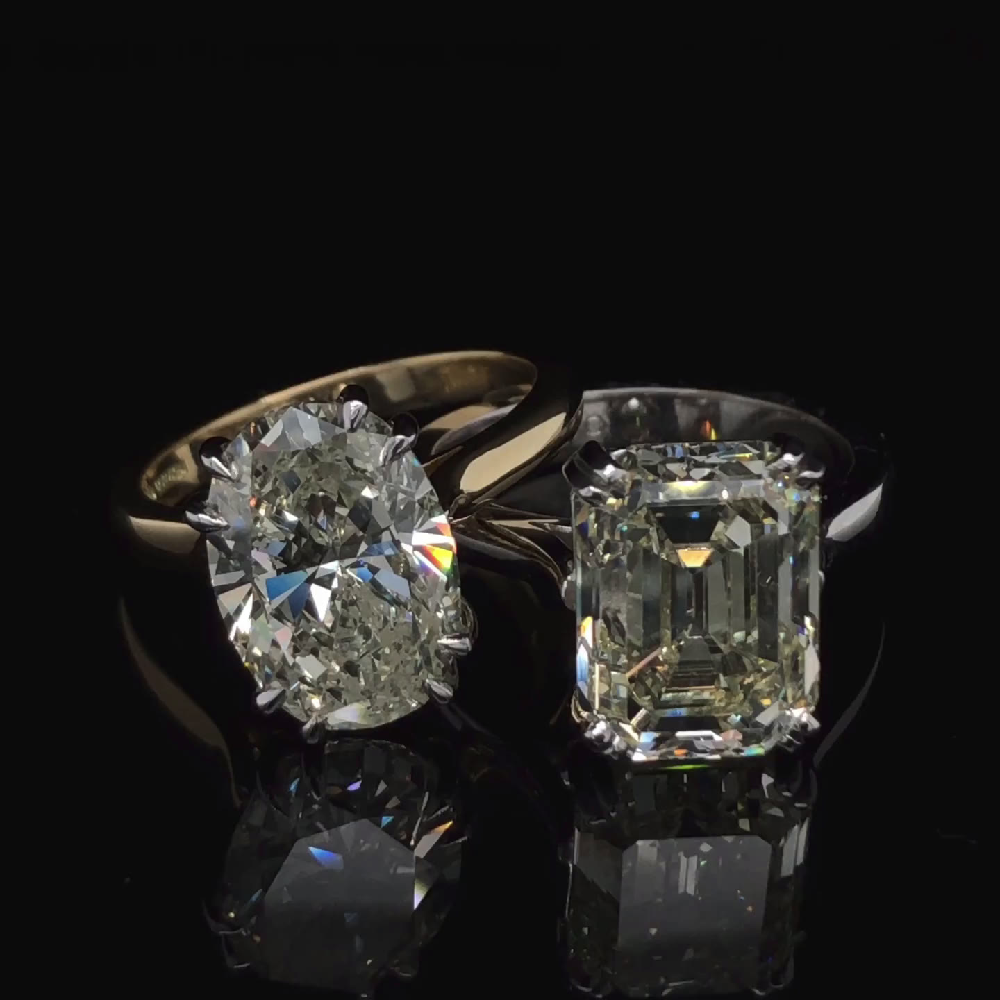

# ✧ Maison Ondine

A luxury jewellery house website: an editorial, motion-rich homepage, a composer to build your own piece from real photographs, a catalogue of 32 pieces with product pages, a bag and a checkout. Built with Next.js 16, React 19, Tailwind CSS 4, GSAP and Lenis.



Live: [ondine-silk.vercel.app](https://ondine-silk.vercel.app/)

---

## ✦ What's inside

### Homepage
- **Hero film** — a seamless 8-second loop of diamond rings turning on black glass, with a letter-spaced wordmark that eases open, a timecode and Pause / Replay.
- **Manifesto** — one long sentence revealed word by word as you scroll.
- **Moodboard** — photographs and the house's own stationery (envelope, wax seal, business card, colour chips) fly in on scroll and can be dragged around with inertia.
- **The atelier in numbers** — counters that roll up digit by digit.
- **Diptych** — pinned panels slide apart while colour returns to a black-and-white photograph only around the jewellery.
- **Collections** — a sticky image that wipes between collections as their names scroll past.
- **Signature pieces** — a draggable, snapping carousel of product cards that tilt toward the cursor.

### The composer — `/composer`
Build a ring, bracelet, necklace or earrings from **real photographs with the background removed** (no 3D renders):
- Choose the piece, the design, the metal, the stones, the size or length, an engraving and the box.
- **Metal changes re-tone the photograph while the diamonds stay white**: each piece has a metal mask, so only the gold is recoloured.
- The chosen loose diamond is shown to scale against a 10 mm rule; the price updates live and the URL is always a shareable link to the exact piece.

### Catalogue — `/jewellery`
- **32 pieces** — rings, bracelets, necklaces and earrings — each a real cut-out photograph.
- Category tabs, filters (metal, price, occasion), sorting; filters live in the URL.
- Metal dots on each card re-tone the photo and update the price.

### Product pages — `/jewellery/[slug]`
- Gallery with a hover loupe, plus photographs of jewellery worn and of the atelier.
- Metal choice (each with its own price), ring size or chain length, optional engraving.
- Details, delivery and care, "Complete the look", and `Product` structured data.

### Bag and checkout — `/checkout`
- **Fly-to-bag**: the piece arcs into the Bag button with a trail of gold sparks; the button bounces and the count pops.
- Checkout with contact, insured delivery or boutique collection, gift wrap and handwritten card, payment method and inline validation.
- A confirmation page with an order number and the next steps.

> There is no back end: orders are kept in the browser (`localStorage`) and **no card details are taken** — the page explains that the house confirms each order and sends payment instructions.

### Throughout
Preloader, page transitions, custom cursor, gold-foil type, paper grain, Lenis smooth scrolling synced with GSAP, and full **reduced-motion** support. Keyboard and screen-reader friendly (radio groups, tablists, live regions, focus management).

---

## ✦ Tech stack

| | |
| --- | --- |
| Framework | Next.js 16 (App Router, Cache Components, static prerendering) |
| UI | React 19, Tailwind CSS 4 |
| Motion | GSAP (ScrollTrigger, SplitText, Draggable, Inertia), Framer Motion, Lenis |
| State | Zustand (bag, composer, orders — persisted to `localStorage`) |
| Media | Unsplash (photos, via a seed script), Pexels (hero film), cut-outs made with `@imgly/background-removal-node` |

---

## ✦ Getting started

Requires **Node.js 20+**.

```bash
git clone https://github.com/hsanjebri/Ondine.git
cd Ondine
npm install
npm run dev
```

Open [http://localhost:3000](http://localhost:3000).

All images are already selected and committed (`data/images.json`, `public/cutouts`, `public/media`), so no API key is needed to run the site.

### Re-selecting photographs (optional)

To change the Unsplash photos, create `.env.local` with an [Unsplash access key](https://unsplash.com/developers) and run the seed:

```bash
# .env.local
UNSPLASH_ACCESS_KEY=your_key_here
```

```bash
npm run seed:images
```

The seed is resumable, stays within the demo limit of 50 requests per hour, records download tracking as Unsplash requires, and regenerates the slot table in `MEDIA.md`.

---

## ✦ Scripts

| Command | What it does |
| --- | --- |
| `npm run dev` | Development server |
| `npm run build` | Production build |
| `npm run start` | Serve the production build |
| `npm run lint` | ESLint |
| `npm run typecheck` | TypeScript, no emit |
| `npm run seed:images` | Fill or update the Unsplash image slots |
| `npm run media:doc` | Regenerate the image table in `MEDIA.md` |

The cut-out pipeline (`scripts/cutouts/`) runs outside the project because the background-removal model is large — see **Composer cut-outs** in [`MEDIA.md`](MEDIA.md).

---

## ✦ Project structure

```
app/
  page.tsx                  homepage
  composer/                 the composer
  jewellery/                catalogue and product pages ([slug])
  checkout/                 checkout and confirmation
  (legal)/, credits/        legal pages, photo credits
components/
  home/                     homepage sections
  composer/                 stage, panel, steps, summary, metal re-toning
  shop/                     product cards, catalogue, product page
  checkout/                 checkout form, order lines, confirmation
  layout/, ui/, media/, motion/, providers/
data/
  products.ts               the 32 catalogue pieces
  collections.ts            homepage collections
  image-slots.ts            every photo slot (query, purpose, pick)
  images.json               the selected Unsplash photos and credits
  cutouts.json              cut-out sizes, sparkle hotspots, metal masks
lib/
  composer-options.ts       composer choices
  pricing.ts                every price rule, in one file
  metal-tone.ts             metal re-toning recipes
  fly-to-bag.ts             the add-to-bag animation
store/                      cart, composer, orders, UI (Zustand)
scripts/                    Unsplash seed, cut-out pipeline
public/
  cutouts/                  cut-out pieces, loose diamonds, metal masks
  media/                    hero film (WebM/MP4) and poster
```

### Editing content
- **Products** — `data/products.ts` (name, photo, metals, stones, price, details, tags).
- **Composer prices** — `lib/pricing.ts`; **composer options** — `lib/composer-options.ts`.
- **Photos** — `data/image-slots.ts` + `npm run seed:images`; cut-outs via `scripts/cutouts/`.

---

## ✦ Media and credits

- Photographs from [Unsplash](https://unsplash.com) under the Unsplash licence, credited on every image (on hover) and on `/credits`. Cut-outs are edited versions (background removed, re-toned), which the licence allows.
- Hero film: [“Elegant diamond rings reflecting light”](https://www.pexels.com/video/elegant-diamond-rings-reflecting-light-34369898/) by Kat IE on Pexels, trimmed to a seamless loop.
- How every file was made and how to replace it with the house's own photography: [`MEDIA.md`](MEDIA.md).

## ✦ Notes
- Re-toned metals are an approximation of the photograph; each piece opens in the metal it was actually photographed in.
- `three` and React Three Fiber remain in `package.json` from the earlier 3D composer but are no longer used.

## ✦ License

Private project. Code © the author; photographs belong to their photographers under the Unsplash and Pexels licences.
